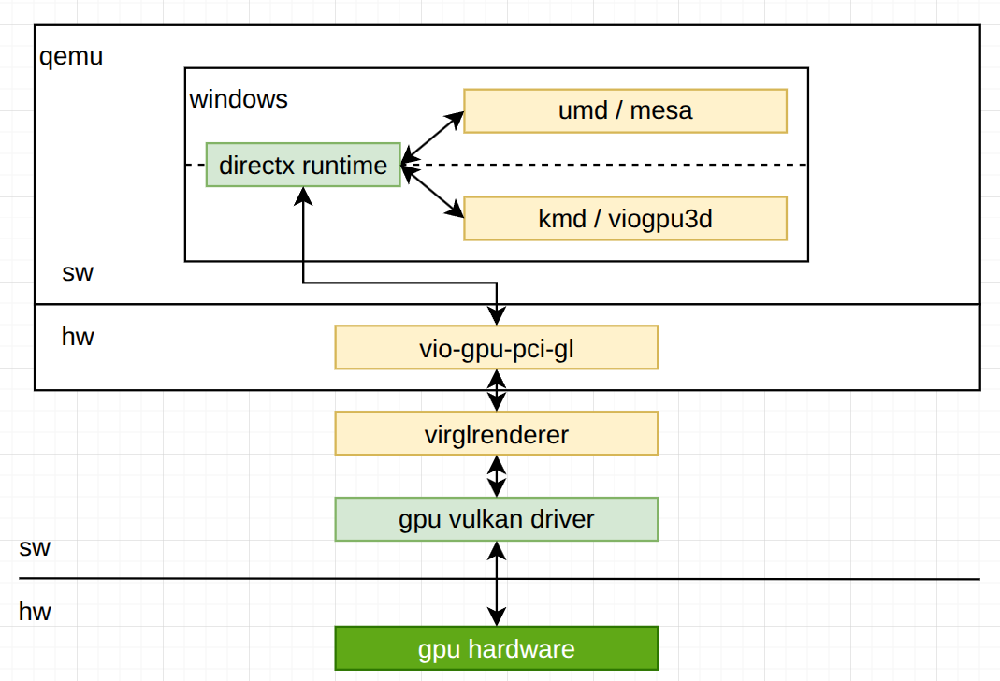
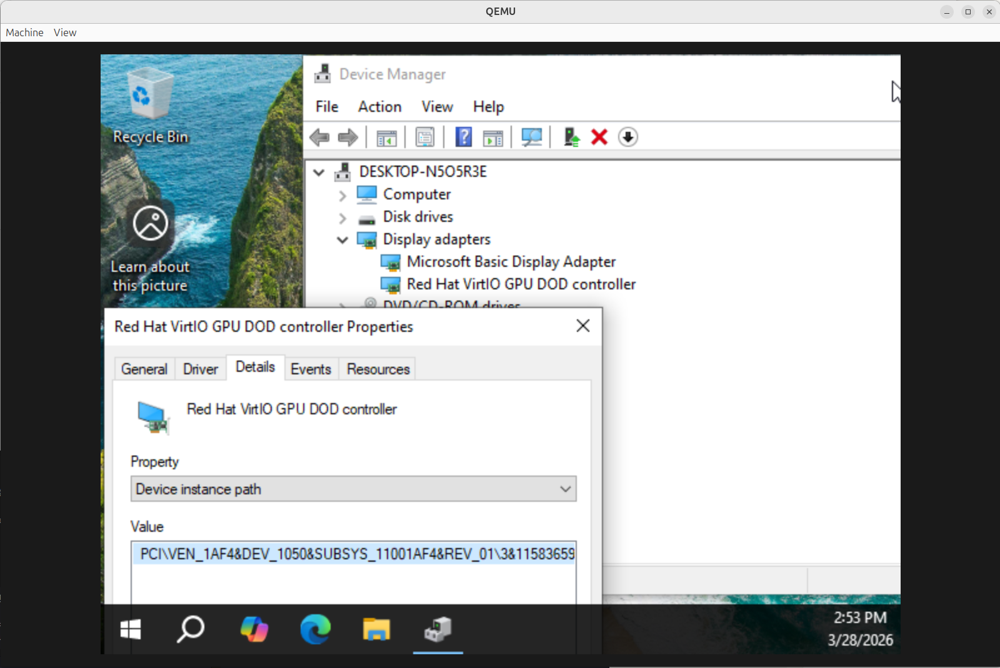
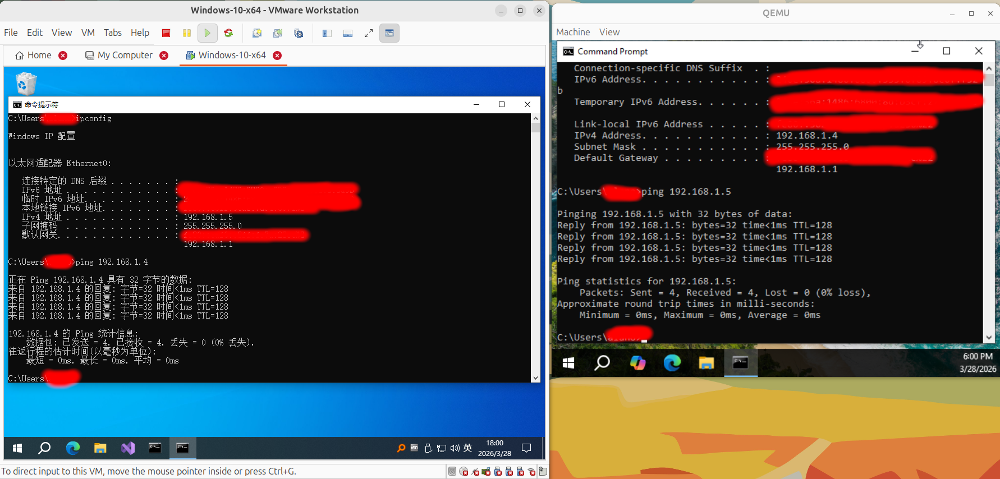
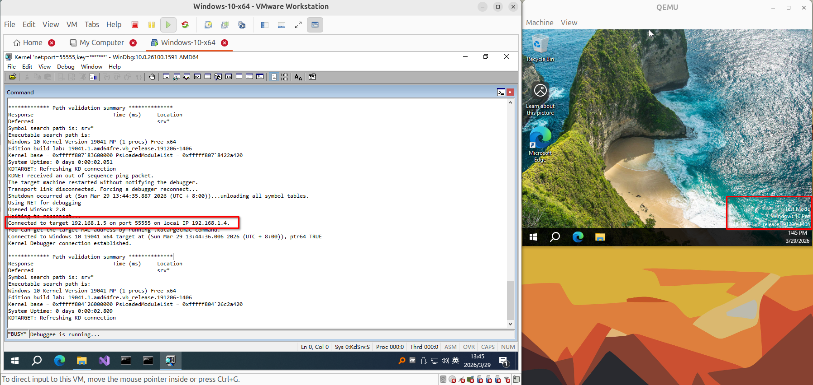
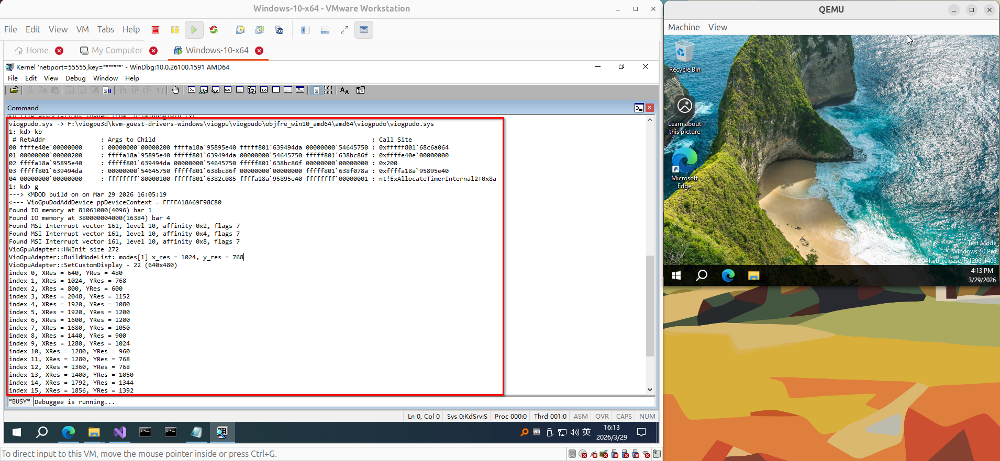

# virtio gpu doc

## 1. architecture



## 2. projects related

### 2.1 viogpu3d (win kmd part)
- https://github.com/virtio-win/kvm-guest-drivers-windows/pull/943

### 2.2 mesa (win umd part)
- https://gitlab.freedesktop.org/mesa/mesa/-/merge_requests/24223

### 2.3 vio-gpu-pci-gl (qemu gpu device)
- https://gitlab.com/qemu-project/qemu
- hw/display/virtio-gpu-pci-gl.c

### 2.4 virglrenderer
- https://gitlab.freedesktop.org/virgl/virglrenderer/-/merge_requests/1185

## 3. build drivers

### 3.1 build viogpu3d
- under win virt machine
- install visual studio 2022 & win wdk
- clone: https://github.com/virtio-win/kvm-guest-drivers-windows/pull/943
- open `kvm-guest-drivers-windows/viogpu.sln`
- build viogpu3d project, then we get `viogpu3d.sys`
- there is also `viogpu3d.inx` file under `kvm-guest-drivers-windows/viogpu/viogpu3d`
- it can be renamed as `viogpu3d.inf` directly, this is the driver install file for windows system
- its content is just like:
```
...
[SourceDisksFiles]
viogpu3d.sys = 1,,f
viogpu_d3d10.dll = 1,,
viogpu_wgl.dll = 1,,
z.dll = 1,,
...
```
- we could know that we need `viogpu3d.sys`, `viogpu_d3d10.dll`, `viogpu_wgl.dll`, `z.dll`
- and `viogpu_d3d10.dll` will be built in mesa project

### 3.2 build mesa
- under win virt machine
- install flex & bison, use this version: `https://github.com/lexxmark/winflexbison/releases`
- install python
- clone: `https://gitlab.freedesktop.org/mesa/mesa/-/merge_requests/24223`
- open "Developer Command Prompt for VS 2022"
- config project:
```cpp
meson .. --prefix=F:\mesa\mesa_prefix  -Dgallium-drivers=virgl -Dgallium-d3d10umd=true -Dgallium-wgl-dll-name=viogpu_wgl -Dgallium-d3d10-dll-name=viogpu_d3d10 -Db_vscrt=mt
```
- build & install:
```cpp
ninja install
```
- finally, we will the following binary in `F:\mesa\mesa_prefix`
```cpp
viogpu_d3d10.dll
viogpu_wgl.dll
z-1.dll
```
- together with `viogpu3d.sys` and `viogpu3d.inf` built before, here is the whole win install package

### 3.3 build virglrenderer
- under linux machine
- clone: `https://gitlab.freedesktop.org/virgl/virglrenderer/-/merge_requests/1185`
- or just the latest virglrenderer
- build and install virglrender lib with meson

## 4. install win system
- download virtio win driver: `https://fedorapeople.org/groups/virt/virtio-win/direct-downloads/archive-virtio/`
- install win on qemu virt machine
```cpp
./qemu-img create -f qcow2 /mnt/ssd/qemu-disk/win-x64-disk.qcow2 80G

../configure --target-list=x86_64-softmmu --disable-docs --disable-werror --enable-sdl --enable-slirp --enable-virglrenderer --enable-gtk --enable-debug

./qemu-system-x86_64 -M q35 -cpu host -smp 8 -m 8G --accel kvm -drive if=pflash,format=raw,file=/usr/share/OVMF/OVMF_CODE_4M.secboot.fd,readonly=on -drive if=pflash,format=raw,file=/mnt/ssd/qemu-disk/OVMF_VARS_4M.fd -device qemu-xhci -device usb-kbd -device usb-tablet -device usb-storage,drive=install -drive if=none,id=install,format=raw,media=cdrom,file="/mnt/ssd/iso/19041.1_PROFESSIONAL_X64_EN-US.ISO" -device usb-storage,drive=virtio-drivers -drive if=none,id=virtio-drivers,format=raw,media=cdrom,file="/mnt/ssd/iso/virtio-win-0.1.285.iso" -device virtio-blk-pci,drive=system -drive if=none,id=system,file=/mnt/ssd/qemu-disk/win-x64-disk.qcow2,format=qcow2 -netdev user,id=net1 -device virtio-net-pci,netdev=net1 -rtc base=localtime -device qxl-vga -display gtk -monitor stdio
```
- ignore the tpm & secure check by add the following DWORD32 key-value in regedit path: `HKEY_LOCAL_MACHINE\SYSTEM\Setup\LabConfig`
```cpp
BypassTPMCheck - 1
BypassSecureBootCheck - 1
BypassRAMCheck - 1
BypassStorageCheck - 1
BypassCPUCheck - 1
```
- install the `viostor.inf` driver in `virtio-win-0.1.285.iso` when the system cannot recognize system disk
- cause there is only `viogpudo` (display only) in offical `virtio-win-0.1.285.iso` package, so we install this driver firstly
- to reduce the system load, disable all unnecessary soft in the win system, such as the firewall and windows defender
- currently, the win desktop will like this:



## 5. debug driver on qemu
- build qemu with `--enable-debug`, `--enable-virglrenderer`, `--enable-gtk` flag
- remember to set the following env before start qemu
```cpp
// without the following evn
// the host gdk will report this: (qemu:70879): Gdk-WARNING **: 14:38:05.466: eglMakeCurrent failed
// and qemu window will black screen when switch from `VGA`(default) to `virtio-gpu-gl-pci`
// I don't know why
export SDL_VIDEODRIVER=x11
export GDK_BACKEND=x11
unset WAYLAND_DISPLAY
export DISPLAY=:0

./qemu-system-x86_64 -M q35 -cpu host -smp 8 -m 8G --accel kvm -drive if=pflash,format=raw,file=/usr/share/OVMF/OVMF_CODE_4M.secboot.fd,readonly=on -drive if=pflash,format=raw,file=/mnt/ssd/qemu-disk/OVMF_VARS_4M.fd -device qemu-xhci -device usb-kbd -device usb-tablet -device usb-storage,drive=virtio-drivers -drive if=none,id=virtio-drivers,format=raw,media=cdrom,file="/mnt/ssd/iso/virtio-win-0.1.285.iso" -device virtio-blk-pci,drive=system -drive if=none,id=system,file=/mnt/ssd/qemu-disk/win-x64-disk.qcow2,format=qcow2 -netdev user,id=net1 -device virtio-net-pci,netdev=net1 -rtc base=localtime -device virtio-gpu-gl-pci -display gtk,gl=on -monitor stdio
```
- for debug driver in win system by windbg, we need two win system, one called `target` which install the driver, one called `host` which run windbg and monitor `target`
- so we run one win system by VMware, cause its official drivers is stable, and another one by qemu, we will install our built driver in it
- firstly we create a bridge net and a tap named `tap-qemu`, and boot qemu with this ned device:
```cpp
sudo ... -net nic,model=e1000,macaddr=52:54:00:12:34:56 -net tap,ifname=tap-qemu,script=no,downscript=no ...
```
- then set VMware net as bridge net, and create bridge net on local pc for qemu, we can use the scripts under `doc` folder
- now we could ping the two win system with each other:



- on the `target` win system, enable windbg connect in admin by net like the following:
```cpp
bcdedit /debug on
bcdedit /dbgsettings net hostip:192.168.1.4 port:55555 key:1.2.3.4
bcdedit /set "{dbgsettings}" busparams 0.2.0 # targe net card pci id in device manager
```
- on the `host` win system, open windbg kernel debug mode, and then reboot `target` win system
- after windbg connect successfully, the `target` win system will enter test mode, and we can install any driver without signature on it, and debug the driver:




